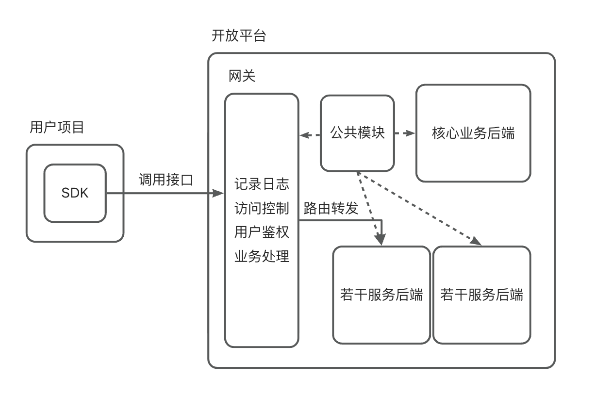

# Waiter! 开放平台

## 项目设计

- 核心业务后端 waiter-backend
  - 用户管理
    1. 注册 / 登陆 / 登出
    2. 获取当前登陆用户视图 [需要登陆]
    3. 更改用户信息 [需要登陆]
    4. 注销账号 [需要登陆]
    5. 查询状态正常的用户视图 [需要登陆] (包括账号和昵称的模糊查询)
    6. 条件查询用户信息 [管理员]
    7. 封禁 / 解封用户 [管理员]
    8. 置为管理员 / 降为普通用户 [超级管理员]
  - 接口信息管理
    1. 查询状态正常的接口信息视图 (包括接口名和描述的模糊查询)
    2. 查看某一接口的详细接口信息视图 (包括调用统计)
    3. 条件查询接口信息 [管理员]
    4. 更改接口信息 [管理员]
    5. 新增接口信息 [管理员]
    6. 删除接口信息 [管理员]
    7. 上线 / 关闭接口信息 [对应的管理员]
  - 调用管理
    1. 在线调用某一接口服务 [需要登陆] (如果用户没有调用过该接口服务，则自动创建调用关系，并默认获得若干调用次数)
    2. 增加调用次数
    3. 查看自己的接口调用统计 [需要登陆]
    4. 封禁 / 解封用户调用某一接口 [管理员]
    5. 查询用户与接口的调用关系 [管理员]
    6. 查询某一接口的调用统计
    7. 查询某一接口的用户调用统计 [管理员]
    8. 利用 SDK 调用某一接口服务
- 公共模块 waiter-common
  - 实体类，视图和枚举类
  - 自定义注解
  - 自定义异常
  - 通用返回类
  - 通用请求类
  - RPC 服务接口
  - 工具类
  - 实体字段校验类
  - 常量
- 网关 waiter-gateway
- 服务后端 waiter-service
- 开发工具包 waiter-sdk
  - 在配置中设置用户的 ak 和 sk，用于自动装配 WaiterClient
  - 使用 WaiterClient 快速调用接口服务