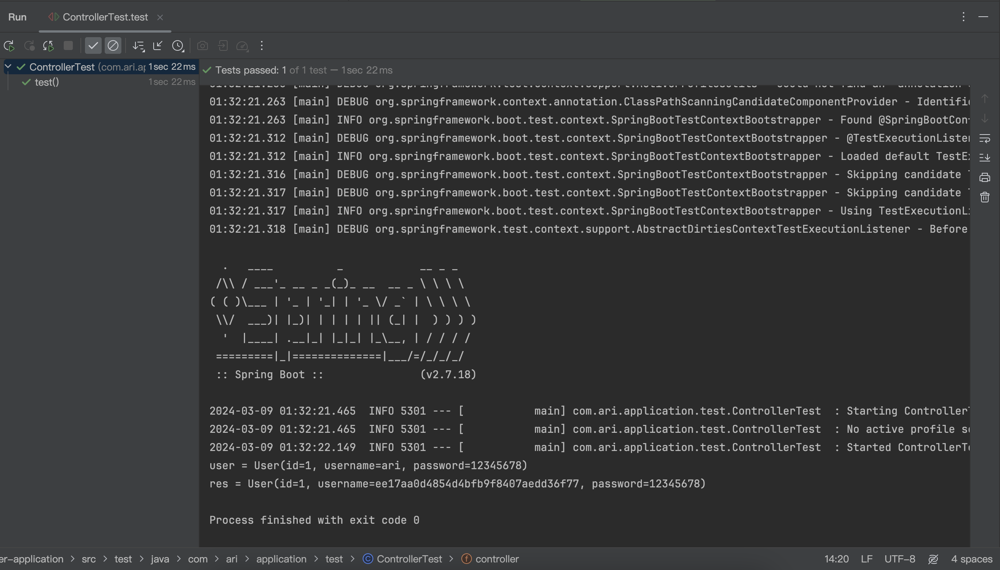
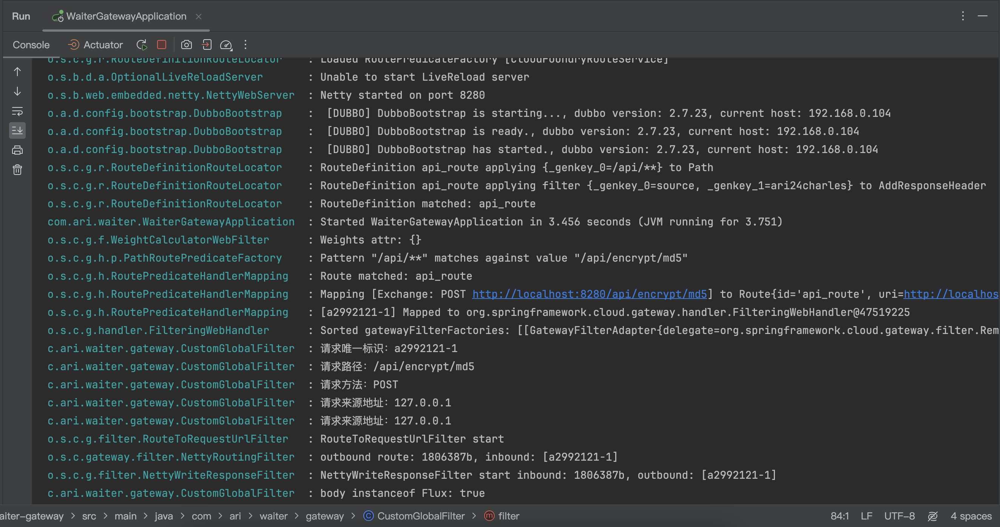

# Waiter! 开放平台

## 测试方式

1. 打开核心业务后端 waiter-backend
2. 打开网关 waiter-gateway
3. 打开提供服务的后端 waiter-service
4. 运行用户应用的测试类 user-application

用户应用结果:

网关信息:

## 项目设计

## 开发历程

[1] 开发提供服务的后端应用 waiter-service

1. 设置应用的端口号为 8180，上下文路径为 /api
2. 开发服务接口 EncryptController，提供一个方法 md5Encrypt，传入一个对象，返回将该对象加密后的字符串

[2] 开发客户端调用工具 waiter-sdk

1. 开发配置类 WaiterClientConfig，使客户端可以通过在项目中配置元数据的方式，将密钥对自动装配到配置类中，并用该密钥对创建 WaiterClient 组件，从而便于客户端注入使用，WaiterClient 类的作用是简化客户端调用接口服务的过程
2. 在 Client 类中提供 post 方法和 getHeader 方法
   - post 方法的第一个参数是被调用接口服务的 URI (如 /api/encrypt/md5)，第二个参数是请求体对象 (可以为空)，方法返回响应体对象
   - getHeader 方法传入一个序列化后的请求体，返回一个包含签名信息的键值对

[3] 开发用户应用 user-application

1. 在 application.yaml 中配置用户的密钥对，并设置应用端口号为 8380
2. 在接口实现类中注入 WaiterClient 类的对象，调用 post 方法，传入接口服务的 URI 和请求体对象，获取接口服务的结果

[4] 开发网关 waiter-gateway

1. 设置应用的端口号为 8280
2. 配置路由转发
3. 定义自定义全局过滤器，打印请求日志和请求头中的签名
4. 实现签名认证过程
   - 密钥用于认证调用者
   - 随机数和时间戳用以防重放
   - body 用以进行签名认证
   - 从数据库中查处调用者的签名密钥，根据相同算法和 body 生成签名，通过比对认证
5. 过滤器执行完才会转发路由，那如何在接口调用完后统计调用次数和打印响应日志？可以通过装饰器模式增强路由转发
   - 先构建一个新的响应，再通过 mutate 方法重建一个新的服务网络交换器
   - 通过 ServerHttpResponseDecorator 装饰器增强路由转发方法
   - 如果遇到响应体过长，会发生分段，那记录日志的时候需要拼接响应体，具体可以使用列表存储每个响应体，最后拼接成字符串
   - 但是仍会出现字符切割的问题，可以使用 dataBufferFactory 的 join 方法统一构建响应体

[5] 开发核心业务后端 waiter-backend

- 用户管理
  1. 注册 / 登陆 / 登出
  2. 获取当前登陆用户视图 [需要登陆]
  3. 更改用户信息 [需要登陆]
  4. 注销账号 [需要登陆]
  5. 查询状态正常的用户视图 [需要登陆] (包括账号和昵称的模糊查询)
  6. 条件查询用户信息 [管理员]
  7. 封禁 / 解封用户 [管理员]
  8. 置为管理员 / 降为普通用户 [超级管理员]
- 接口信息管理
  1. 查询状态正常的接口信息视图 (包括接口名和描述的模糊查询)
  2. 查看某一接口的详细接口信息视图 (包括调用统计)
  3. 条件查询接口信息 [管理员]
  4. 更改接口信息 [管理员]
  5. 新增接口信息 [管理员]
  6. 删除接口信息 [管理员]
  7. 上线 / 关闭接口信息 [对应的管理员]
- 调用管理
  1. 在线调用某一接口服务 [需要登陆] (如果用户没有调用过该接口服务，则自动创建调用关系，并默认获得若干调用次数)
  2. 增加调用次数
  3. 查看自己的接口调用统计 [需要登陆]
  4. 封禁 / 解封用户调用某一接口 [管理员]
  5. 查询用户与接口的调用关系 [管理员]
  6. 查询某一接口的调用统计
  7. 查询某一接口的用户调用统计 [管理员]
  8. 利用 SDK 调用某一接口服务

[6] 将可复用的方法和对象实体抽象为公共模块 waiter-common

## 待优化点

- 接口服务不可用时，触发熔断机制
- 使用 RPC 时的异常处理机制 - 原因 RPC 接口实现类声明问题
- 调用管理的统计模块还没有实现